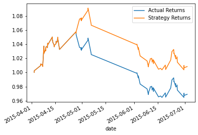
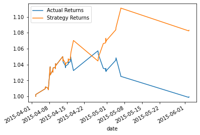
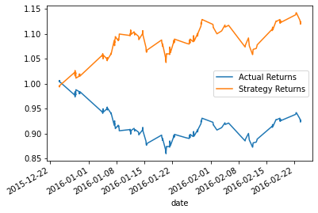
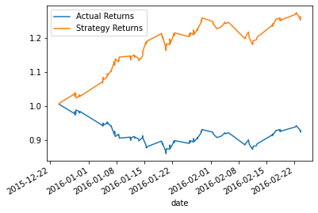

# deep_learning_algo_trader

I am creating an algorithmic trading bot that learns and adapts to new data and evolving markets. I am implementing an algorithmic trading strategy that uses machine learning to automate the trade decisions, adjusting the input parameters to optimize the trading algorithm, and training a new machine learning model. I am comparing the new models performance to that of the baseline model.

## Technologies

This project leverages python 3.7 with the following modules:
* [pandas](https://github.com/pandas-dev/pandas) - For reading data into a DataFrame and analyzing data via statistics and plots.

* [numpy](https://numpy.org) - For computation.

* [hvplot](https://hvplot.holoviz.org) - For plotting in various formats working with a wide array of datatypes in the PyData ecosystem.

* [csv](https://docs.python.org/3/library/csv.html) - For reading and writing tabular data in CSV (Comma Seperated Values) format.

* [pathlib](https://docs.python.org/3/library/pathlib.html) - For representing the file system path to a csv.

* [sklearn](https://scikit-learn.org/stable/user_guide.html#) - For machine learning.

* [matplotlib](https://matplotlib.org/stable/users/index.html) - For embedding plots in the application.

## Screen Shots

Baseline Performance:

Decreasing training months to 2 months:

Decreasing short window to 3 and long window to 50:

Tuned parameters with Random Forrest Classifier Performance:

## Summary

Based on the data recieved from the original baseline, tuned baseline, and tuned baseline parameters with new Classifier we can see that the tuned parameters with new Classifier performed the best out of the rest of the testings.

## Contributors

Jose Medina

## License 

MIT
